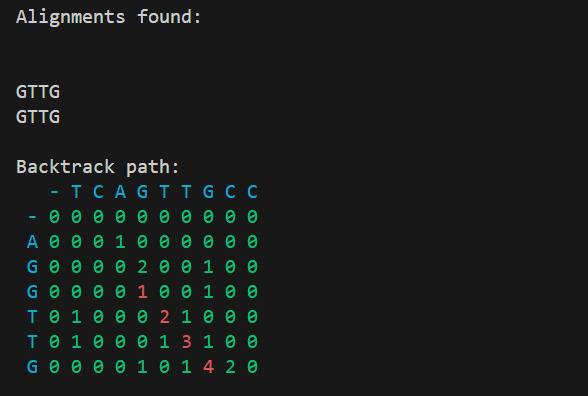

# Smith-Waterman Algorithm

## Introduction
This implementation of the Smith-Waterman algorithm is made for easy use and integration into other projects. It is written in Python and is designed to be easy to understand and modify.

The Smith-Waterman algorithm is a dynamic programming algorithm that is used to find the best local alignment between two sequences. It is an improvement of the Needleman-Wunsch algorithm, which is used to find the best global alignment between two sequences. The Smith-Waterman algorithm is generally used in bioinformatics to find the best local alignment between two DNA or protein sequences.

## Usage
The Smith-Waterman algorithm is implemented as a class called `ScoreMatrix` that takes two sequences and score points (match, mismatch and gap scores) as input and returns the local alignments possibilities between the two sequences by the method `getAlignments`. The sequences can be any string.

To use the Smith-Waterman algorithm, first import the `ScoreMatrix` class from the `score_matrix` module. Then, create an instance of the `ScoreMatrix` class with the two sequences and the value of match, mismatch and gap as input. Finally, call the `getAlignments` method on the instance to get the alignments between the two sequences.

```python
from score_matrix import ScoreMatrix

matchScore = 1
missScore = -2
gapScore = -2
vSeq = 'AGGTTG'
hSeq = 'TCAGTTGCC'

# Create a instance of score matrix
matrix = ScoreMatrix(matchScore, missScore, gapScore, vSeq, hSeq)

alignments = matrix.getAlignments()

print('Alignments found:\n')

for alignment in alignments:
    print('-' * 25 + '\n')
    print(f'Alignment:\n{alignment.hAlign}\n{alignment.vAlign}\n')

```

The alignments returned are a class (Alignment) that contains the local alignment into two strings (vAlign and hAlign) and the backtrace path. The alignment is represented by the vertical and horizontal sequences with gaps represented by '-'. The path is a list of tuples that represents the path taken by the algorithm to find the alignment. Each tuple contains the coordinates of the cell in the matrix that was visited.

To see the score matrix um can just print the matrix attribute of the instance.

```python

print(matrix.matrix)

```

In the `example.py` file there is a function that prints the matrix and the alignments found in colors in the terminal.


## License

This project is licensed under the MIT License - see the [LICENSE.md](LICENSE.md) file for details.
